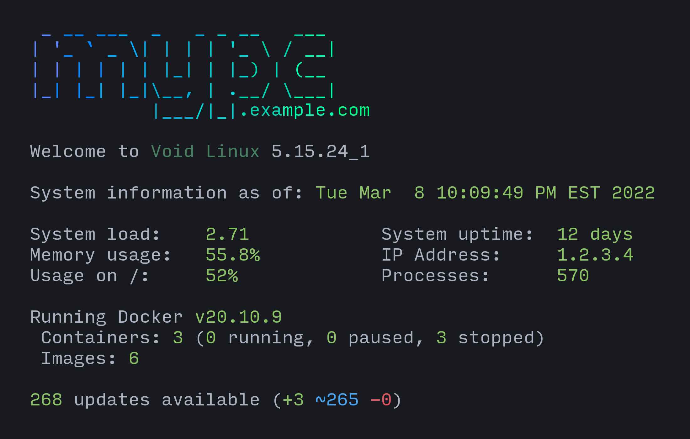

# motdd

A small shell script to manage `/etc/motd`.

## Usage

Install `bin/update-motd` somewhere on your `$PATH`.

Create `/etc/update-motd.d/` and put the scripts to generate the MOTD in it. Ensure they are executable.
If packaging this program, `/usr/share/update-motd.d/` can be used as a fallback path for system defaults.

On systems with runit and [snooze](https://github.com/leahneukirchen/snooze) (like Void Linux), the service in `runit/` can be used.
Otherwise, a cronjob, systemd timer, or similar method for running `update-motd` periodically works.

See [here](https://github.com/classabbyamp/void-packages/blob/motdd/srcpkgs/motdd/template) for an example package template for motdd.

## Examples

Two examples of scripts are provided:

### Basic

A simple MOTD.

### Fancy

A showy MOTD. Requires:

- lolcat
- figlet
- curl
- docker (optional)
- xbps (optional)

