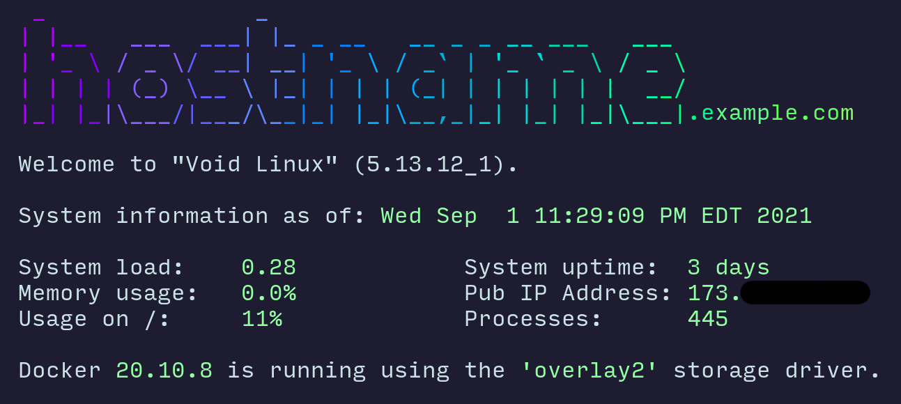

# motd

My little dynamic motd scripts.



## Requirements

- lolcat
- figlet
- curl
- bash
- docker

## Usage

On systems that include `/etc/update-motd.d/`: copy the contents of `update-motd.d/` to that directory.

On other systems:

```
# cp ./update-motd.sh /usr/local/bin/
# cp -r ./update-motd.d /usr/local/share/
# crontab -e
```

In the crontab, add something like this (this runs every hour at 0 minutes past the hour):

```
0 * * * * /usr/local/bin/update-motd.sh
```

